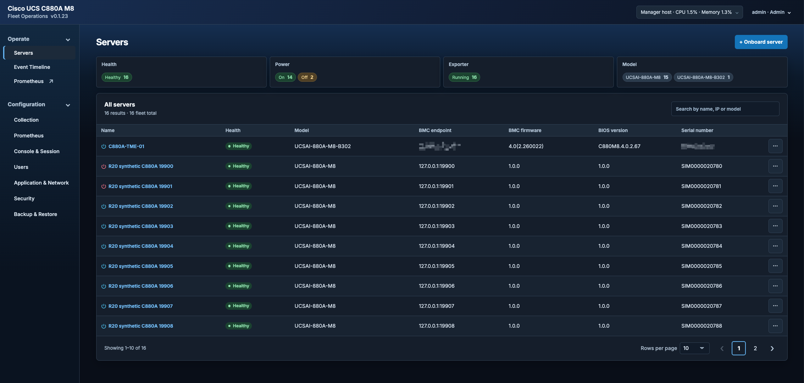

# Cisco UCS C880A M8 - Fleet Manager

This is not an official Cisco application and is provided without warranty. See [LICENSE-CISCO.md](LICENSE-CISCO.md) for the terms.

*Transparency: code and documentation are AI-assisted, with automated testing and security reviews guided by security best practices.*

## Abstract

A Linux fleet manager for Cisco UCS C880A systems. It provides inventory, events, 24-hour local metric history, a browser vKVM gateway, one HTTPS exporter per claimed server, and one managed Prometheus service for the fleet. Grafana runs separately. There is no HA. **Collect Tech Support** is disabled.



For daily use, example screenshots and configuration, see the [user guide](USER_GUIDE.md). To run only a synthetic C880A Redfish endpoint, see the [Redfish simulator guide](REDFISH_SIMULATOR_GUIDE.md); the manager is not required.

## Validation and scalability

Tested with one physical Cisco UCS C880A M8 (UCSAI-880A-M8-B302), running BMC firmware 4.0(2.260022) and BIOS C880M8.4.0.2.67, alongside 15 simulated targets. Larger physical fleets have not been qualified; maximum fleet size and resource requirements remain undetermined. Results may vary with firmware, BMC workload and network conditions.

As you add servers, use **Manager host** to monitor CPU and memory usage, and download the **collection log** from **Configuration → Application & Network** to review collection timings and recovery results. Monitor disk and network usage with host tools.

**Project status:** This project is an early 0.x release and may contain bugs or limitations. Feedback and contributions are welcome. Maintenance is provided on a best-effort basis, fixes and response times are not guaranteed.

## Requirements

Ubuntu Server 24.04 with systemd, Python 3.12, Internet access during installation for Python packages and Prometheus, a non-loopback host IP, and an account with sudo access.

Passwordless sudo is not required. When sudo requires a password, it prompts at the start of installation or uninstall. A non-root account without sudo access cannot install or uninstall the service.

## Install

Clone the repository and install:

```sh
git clone --branch main --single-branch https://github.com/rtortori/c880a-fleet-manager.git
cd c880a-fleet-manager
./install.sh
```

The installer checks assigned addresses and port availability, asks for an address when several are available, and prompts for the HTTPS port. TCP 443 is the default; if occupied, it proposes 8443. Link-local addresses are excluded. It installs the application under `/opt/c880a-manager`, its Python dependencies in `/opt/c880a-manager/venv`, and an unprivileged `c880a-manager` systemd service that starts at boot. If UFW is active, it adds rules for the selected manager, exporter, and console ports.

The installer shows its current stage and elapsed time while Python packages download.

Sign in as `admin` with password `admin`. The first login requires a password change before the UI or API can be used.

```sh
sudo systemctl status c880a-manager
sudo journalctl -u c880a-manager -n 100 --no-pager
```

The service starts at boot and restarts after a process failure. Persistent state resides under `/var/lib/c880a-manager` with restricted access.

## Upgrade

From the repository checkout:

```sh
git pull --ff-only
./install.sh
```

The installer shows the version and HTTPS settings before confirmation. It stops the service, saves a root-only safety backup under `/var/backups/c880a-manager`, installs the updated package, and checks HTTPS. If activation fails, it restores the previous package and data. Existing state is retained.

## Uninstall

Run `./uninstall.sh` from the checkout and type `PURGE` to confirm. `./uninstall.sh --purge` performs the same removal. This deletes the service, application and virtual environment, manager data and certificates, all manager safety backups, installer-owned UFW rules, and the dedicated service account and group. There is no local recovery copy; download a full archive from **Configuration → Backup & Restore** first if one is needed.

The repository checkout, shared OS packages, and systemd journal history remain on the host.
