# Cisco UCS C880A Manager — User Guide

This guide covers the manager UI after installation. The running version appears below the application name. Screenshots show example settings and data. Administrator controls appear under **Configuration**; read-only users can view fleet data but cannot change settings or run server actions.

## Servers

**Servers → Onboard server** asks for a display name, BMC IP address, and BMC credentials. The manager host must reach the BMC over HTTPS. Certificate verification is on by default; the form offers a per-server exception for an untrusted BMC certificate. Validation continues in the background if the dialog is closed.

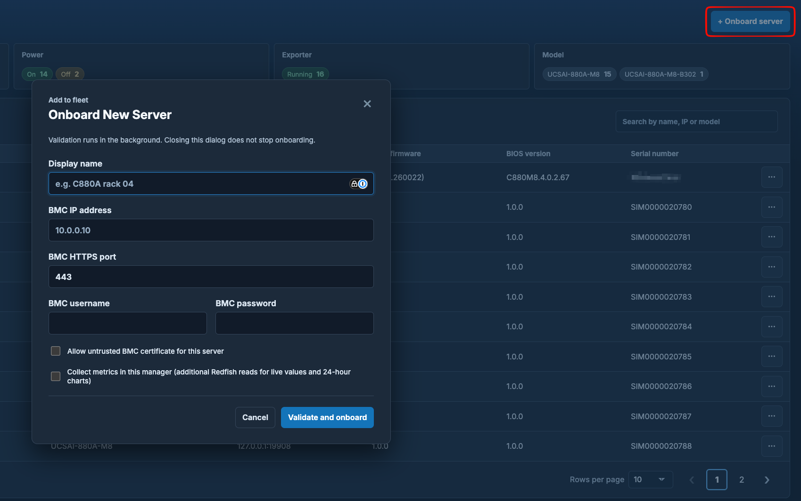

The server table shows health, model, BMC address, firmware, BIOS, and serial number. Open a server for **General**, **Inventory**, and **Metrics** views. **General** shows properties, collection state, and recent events. **Inventory** groups Redfish components and supports search and manual refresh. **Metrics** shows latest readings and, when manager metric collection is enabled, up to 24 hours of local history.

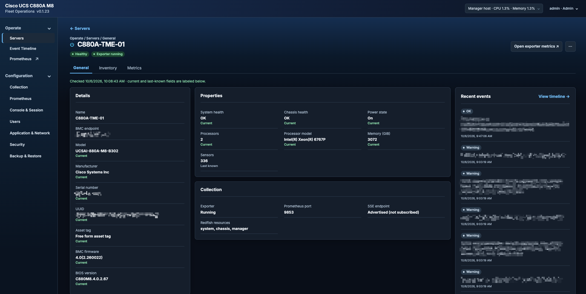

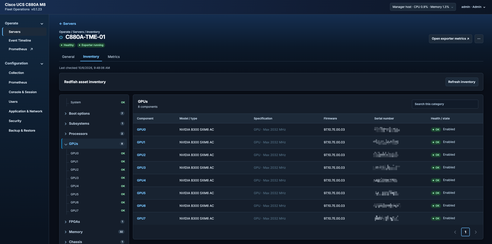

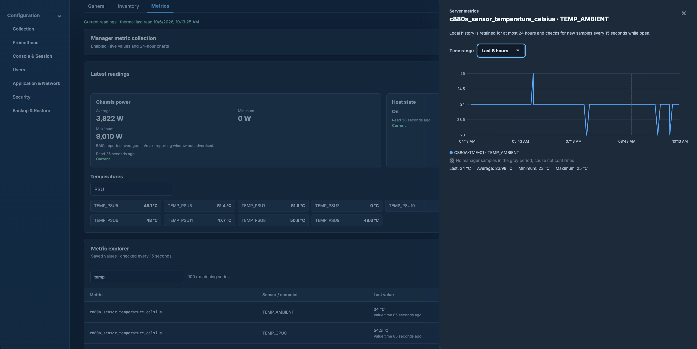

Each claimed server has its own HTTPS Prometheus exporter. **Open exporter metrics** opens that server's `/metrics` endpoint. Exporters refresh their completed-pass cache in the background, independently of Prometheus scrapes. HTTPS service discovery is available at `/api/prometheus/targets` with the bearer token stored in `/var/lib/c880a-manager/discovery-token`.

Exporters reuse saved sensor lists and collect readings in the background.
Temporary read failures are retried automatically, and sensor lists are rediscovered daily.
Original timestamps are preserved; missing or unavailable readings are reported.

The server action menu provides power controls, BMC reboot, vKVM, BMC access, manager metric collection, and unclaim. Unclaim permanently deletes that server's local data and managed Prometheus history. Managed scraping pauses during cleanup; external systems and backups are unaffected. Pending history cleanup is recoverable under Configuration → Prometheus. **Collect Tech Support** is disabled.

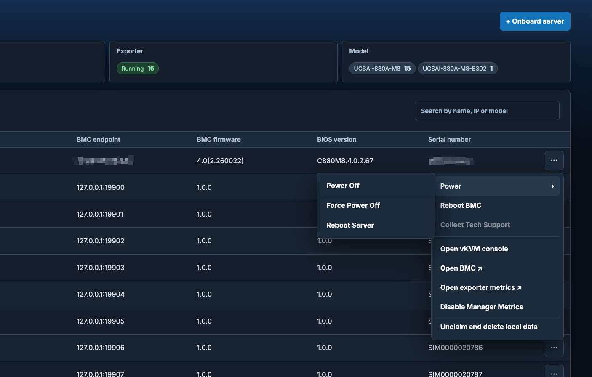

## Event Timeline

**Event Timeline** shows collected BMC events across the fleet. Filter by server, refresh the view, or open an event for its details.

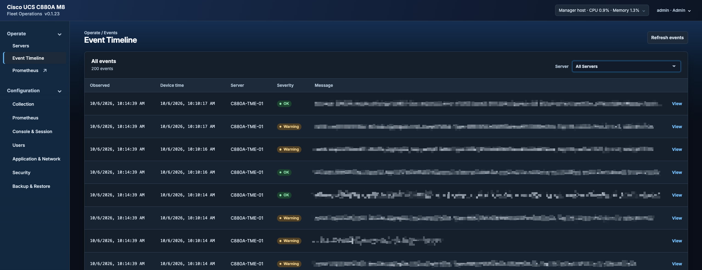

## Configuration → Collection

Set fleet intervals for inventory, health and power, lightweight manager metrics, and full manager scrapes. Inventory can also have a per-server interval override; a blank override uses the fleet value. Changes apply immediately. The 24-hour local metric retention and event/log reconciliation cadences are displayed as fixed values.

Lightweight metrics read server power state, chassis power consumption, and available temperatures. Their default refresh interval is 60 seconds. Inventory refresh defaults to one hour; each scan's duration depends on the server and BMC responsiveness.

Manager metric collection can be enabled per server. Disabling it pauses manager readings and history for that server; the independent exporter remains available for external scrapes.

Redfish event collection works without optional SNMP traps, which require a separately configured SNMPv3 receiver and BMC alert destination.

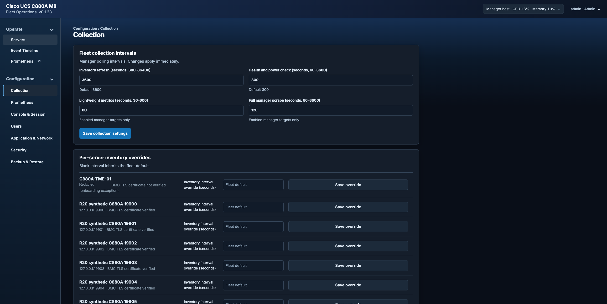

## Prometheus

**Operate → Prometheus** opens the fleet's managed Prometheus query and Targets views using your manager session and HTTPS certificate. Both roles can query. After session expiry, sign in again to return to the intended view. Clients must trust the manager certificate or its issuer.

For external Grafana, use a separately configured Prometheus instance that scrapes the HTTPS exporters using authenticated service discovery. The managed query endpoint uses your browser session.

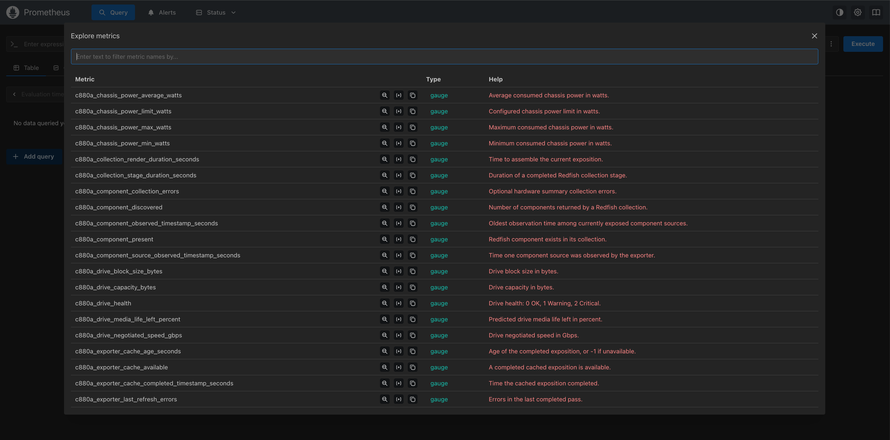

## Configuration → Prometheus

One global service monitors all claimed exporters and is enabled by default. **Enabled** starts or stops managed scrapes; disabling preserves stored history. Independent exporters remain available. Claims appear automatically through authenticated HTTPS discovery, refreshed every 15 seconds. Defaults are a 30-second scrape interval, 10-second timeout, up to 24 hours of history, and a 1 GiB storage budget.

The status panel separates discovered exporters from successful scrapes. Unknown counts indicate unavailable observations; incomplete discovery requires checking Targets and exporter reachability. Successful scrapes (`up=1`) do not prove healthy or fresh BMC acquisition; inspect `c880a_target_up`, cache age, refresh errors, and source timestamps.

Defaults appear below each field; hover, focus, or tap **?** for effects and ranges. Timeout must not exceed interval. **Apply settings** restarts Prometheus when Enabled; Disabled remains stopped. Rejected or failed changes retain or recover prior settings. Check **Last operation**; use **Retry recovery** if recovery is unconfirmed. After a connection failure, check status before retrying.

Reducing retention or storage can delete older history. The storage budget limits retained data, not total disk usage; allow headroom for active writes and backups. Retention applies again on re-enable. **Open Prometheus** opens a new tab.

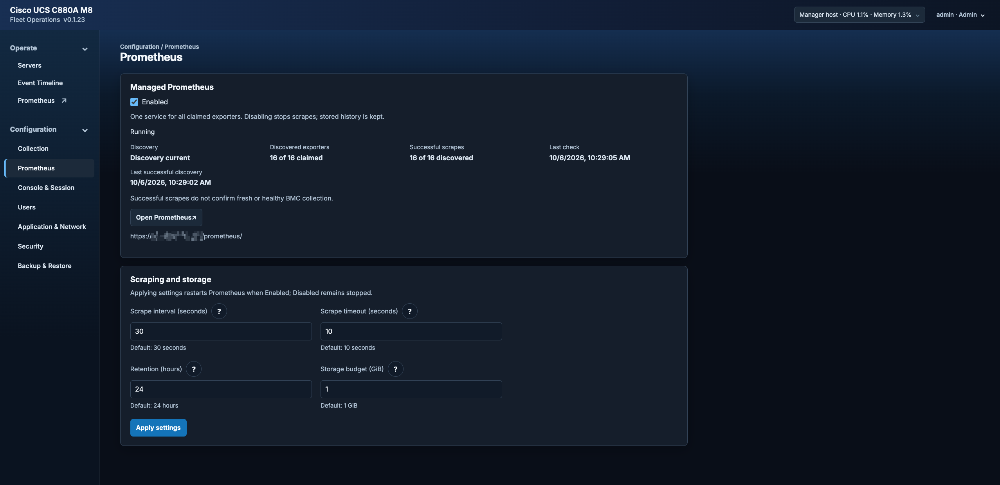

## Configuration → Console & Session

Set the virtual console inactivity timeout and the manager sign-in inactivity timeout. The console timer is renewed by keyboard or mouse activity, or by **Keep console open**. Manager sessions also have an eight-hour absolute limit.

An administrator opens vKVM from the server action menu. The console runs through the manager's authenticated HTTPS gateway and closes when its session or idle lease ends.

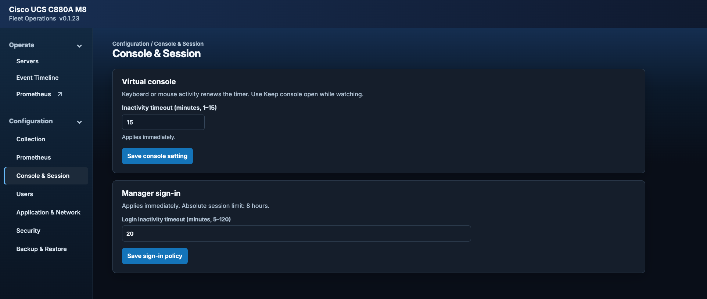

## Configuration → Users

Administrators can add local users, assign **Admin** or **Read-only** roles, change passwords, and manage accounts. Read-only users can inspect servers, inventory, metrics, and events; they cannot use server actions, vKVM, onboarding, or Configuration.

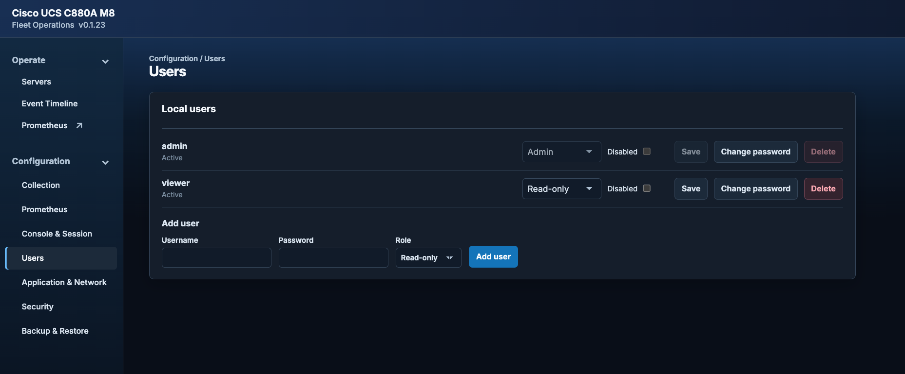

## Configuration → Application & Network

**Deployment network** selects one assigned local IP for the manager, exporters, and console gateways. An optional advertised DNS name can be used when it resolves to that IP. Set the manager port, exporter port range, and console port offset here. Link-local IP addresses are unavailable.

Applying network changes restarts HTTPS listeners and interrupts active scrapes and consoles. Activation verifies HTTPS endpoints and the expected Prometheus state, preserving Enabled or Disabled. Failed activation restores the prior configuration. **Restart application** restarts the manager and exporters without rebooting the host. **Deployment details** shows the effective endpoints.

**Download collection log** saves collection timings and recovery results by server name for troubleshooting.

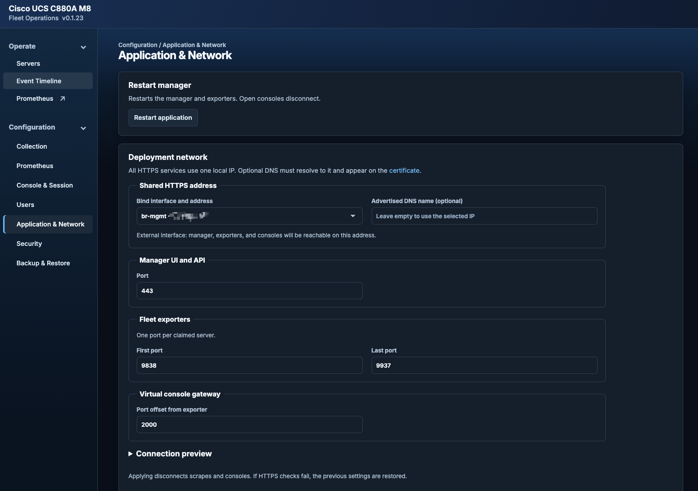

## Configuration → Security

**HTTPS certificate** shows the active certificate and its expiry. The initial self-signed certificate lasts 10 years and covers the selected IP. Generate a replacement certificate locally, or install an operator-provided PEM certificate, optional chain, and matching private key. The certificate must cover the published DNS name, or the selected IP when no DNS name is set. Certificate changes restart HTTPS endpoints and verify coordinated Prometheus activation or recovery. Configure browser trust explicitly for the issuing CA or self-signed public certificate; managed Prometheus updates its internal trust automatically. External clients need their own trust configuration.

**Outbound BMC trust** installs a custom PEM CA bundle for BMC connections or restores system trust. Exporters restart after a change.

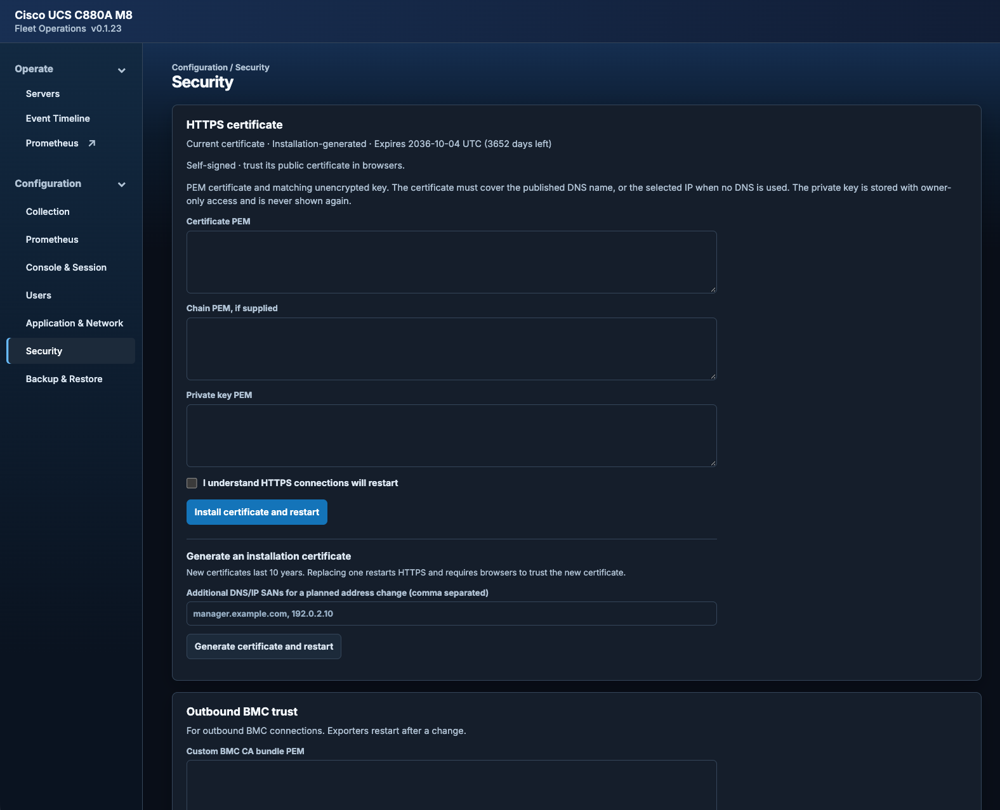

## Configuration → Backup & Restore

**Full installation** includes users, all claimed servers and local data, configuration, certificates, private keys, and the entire managed Prometheus database and settings, including history retained while Disabled. **Servers only** includes every archived claim, its local data, and all its retained Prometheus history. Restore Servers only into an installation with no claimed servers; destination users, global settings, Prometheus settings, and unrelated retained history are preserved. Each mode restores its whole archive without selections.

Set and confirm a passphrase of at least 16 characters, then prepare the backup. Preparation shows progress and can be canceled. Temporary archives expire 15 minutes after preparation starts or on sign-out. **Download backup** starts the browser download; confirm that the file was saved and keep the passphrase separately.

Both scopes require the destination to run the same or a newer application version than the backup. Upgrade an older destination before restoring. Archives without a verifiable application version are rejected; create a new backup from the source installation.

For a restore, upload the archive and passphrase, then **Validate and preview**. The preview shows the impact without changing data. Review history, resulting Prometheus state, settings changes, and required disk space. If enabled retention or storage would discard incoming history, adjust the source settings and create a new Full backup, or adjust destination settings and preview Servers only again. A full restore can select a replacement local HTTPS IP; doing so generates a new self-signed certificate. To apply the reviewed restore, re-enter the passphrase and type `RESTORE`. Active scrapes and consoles disconnect. A full restore replaces installation settings and signs out existing sessions; activation verifies HTTPS and the expected Prometheus state. Failed activation restores the matched prior installation. If recovery is Unconfirmed, keep recovery files, check service health, and use **Check restore status** before retrying.

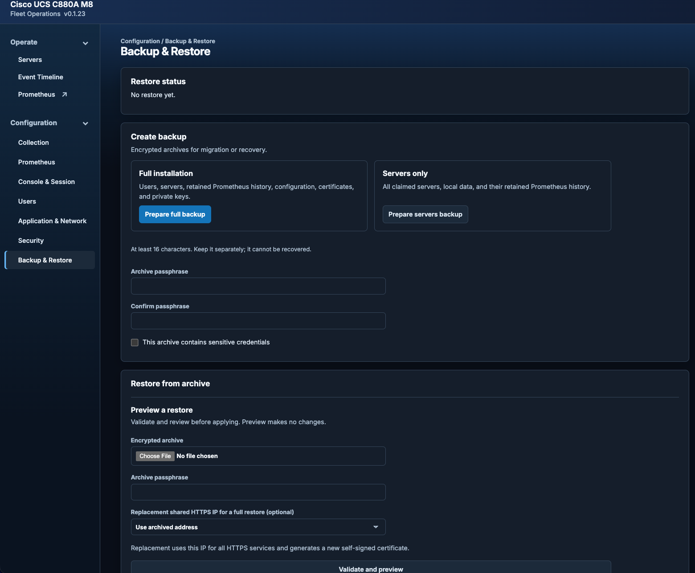
